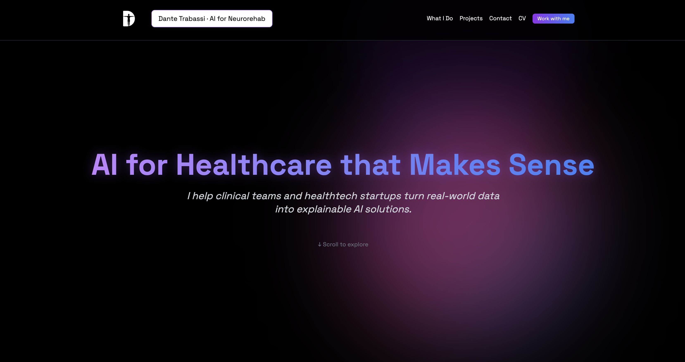

# 🧠 AI Consulting Portfolio · Dante Trabassi

---

## 👨‍💻 Overview

Welcome to the official portfolio of **Dante Trabassi**, Biomedical Engineer, PhD candidate, and AI Research Fellow at Sapienza University of Rome.

This website showcases my most impactful projects at the intersection of:

- 🧬 Artificial Intelligence in Healthcare
- 🦿 Biomechanics & Movement Analysis
- 💡 Explainable Machine Learning & Generative Models

> ⚡ Designed with performance and simplicity in mind.  
> 🛠️ Built from scratch using modern web technologies.

---

## 🔗 Live Site

👉 [https://dantetrb.github.io/ai-consulting/](https://dantetrb.github.io/ai-consulting/)

---

## ✨ Preview

  

---

## 🚀 Tech Stack

- **React** – CRA (Create React App)
- **Tailwind CSS** – for modern utility-first styling
- **Framer Motion** – for smooth transitions
- **Lucide Icons** – crisp, clean icons
- **tsParticles** – interactive particle background
- **GitHub Pages** – production deployment

---

## 🗂️ Project Structure

📁 public/
├─ logos/ # Partner logos
├─ tpose.png # Preview image
└─ index.html # HTML template

📁 src/
├─ components/ # Reusable UI components
├─ data/ # Logo and project data
└─ App.jsx # Main App component

---

## 🧪 Local Development

# 1. Install dependencies
npm install

# 2. Start local server
npm start

# Build optimized production bundle
npm run build

# Deploy to GitHub Pages
npm run deploy

"homepage": "https://dantetrb.github.io/ai-consulting"

## 📬 Contact
✉️ Email: dantetrb@gmail.com
Linkedin: Dante Trabassi
GitHub: @DanteTrb

## 📘 License
MIT © Dante Trabassi
